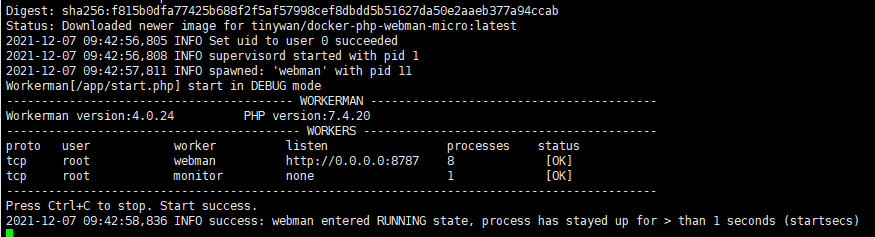

## Inc

Webman Lightweight container with PHP 7.4 based on Alpine Linux.

## build

```
docker build -t tinywan/docker-php-webman-micro:0.1 .
```

## run

### debug
```
docker run --rm -it -p 8080:8080 --name micro-webman tinywan/docker-php-webman-micro
```

output


### daemon
```
docker run -d -p 8080:8080 -name micro-webman tinywan/docker-php-webman-micro
```

